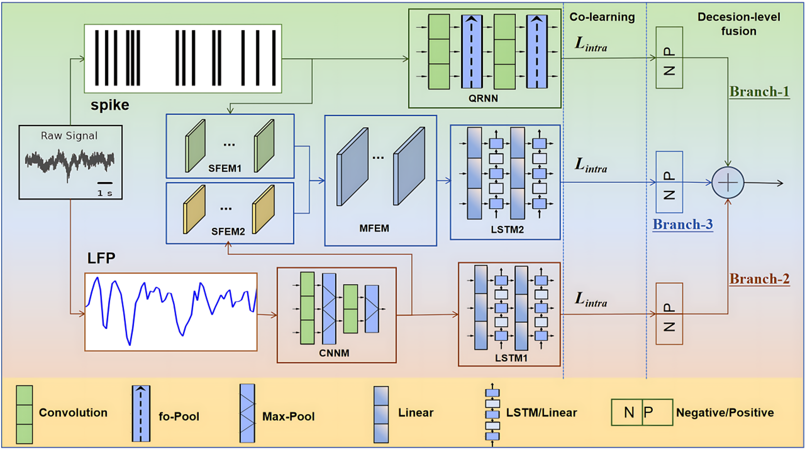

# MFND - 多模态融合神经解码 (Multi-modal Fusion Neural Decoder)

## 项目简介

MFND 是一个基于 TensorFlow 2.3.0 和 Keras 构建的脑机接口 (BMI) 系统，专注于多模态神经信号的处理和解码。该项目实现了多种深度学习模型，用于从神经电生理信号（如 Spike 和 LFP）中解码运动意图。

### 框架架构

该框架展示了 MFND 的多模态融合架构，包括：
- 原始信号处理（Spike 和 LFP）
- 特征提取模块（SFEM1、SFEM2、CNNM）
- 多模态特征融合（MFEM）
- 序列建模（LSTM1、LSTM2、QRNN）
- 决策级融合（Branch-1、Branch-2、Branch-3）

框架通过协同学习（Co-learning）和决策级融合，充分利用了不同模态数据的互补信息，提高了解码性能。

## 技术栈

- Python 3.9+
- TensorFlow 2.3.0
- Keras
- NumPy
- SciPy
- h5py

## Dataset
This repository uses neural data from publicly available dataset deposited on [Zenodo](https://zenodo.org/record/3854034) by Sabes lab.

如有问题或建议，请联系项目维护者。
